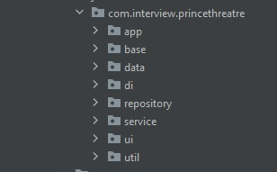

# Prince Theater
The movie price comparison android sample project between Filmworld and Cinemaworld theater. People can see which film is available and compare price between two cinemas.\

------------
  
------------
## Build & Run Prince Theater Application
Before building the project, must prepare

- Install Android Studio (or any other build tool) with any version, but `Android Studio Electric Eel | 2022.1.1 Patch 1` is recommended version for this project.

Steps:
- First clone the repo: `git clone https://github.com/stsdoannguyenhuy/prince-theatre.git`
- Next open Android Studio and select `File->Open` and navigate to the root directory of the project
- Then select the directory choose the `build.grale` in the cloned repo.
- After that, click `OK` to open the project in Android Studio. In this step, gradle will sync and download the needed library
- Finally, after gradle sync successfully, Select `Run -> Run 'app'` from the menu or press `shift + f10` to run application. In this step, you must choose the device (virtual or real device) you want to run the app and click `OK`
------------
## This sample code is using
- [Kotlin language](https://kotlinlang.org/)
- [Hilt Dagger Dependency Injection](https://dagger.dev/hilt/)
- [Retrofit](https://square.github.io/retrofit/)
- [RxKotlin](https://reactivex.io/)
- Mockito for unit test
- Android basic layout and components
- Backend API from [challenge api](https://challenge.lexicondigital.com.au/api/v2/filmworld/movies) with `x-api-key` provided

## Source code structure

- `app`: android application instance
- `base`: our base classes, such as `BaseActivity`
- `data`: contains only data class (Pojo, DTO, model...)
- `di`: Dependency Injection
- `repository`: defines get/update/delete actions of object. In this project, that's `FilmRepository`
- `service`: Our business logic should come here
- `ui`: contains files related to the layout, view, activity, dialog...
- `util`: some helper files and functions
----------
## Testing
### Backend API testing
Call multiple times to [backend api](https://challenge.lexicondigital.com.au/api/v2/{theater}/movies) with provided key by using network tool like `Postman`. I saw some results:
- Success 200 with data in body. Response body is never changed if code is success
- Forbidden 403 if do not pass or pass wrong `x-api-key` in header. Just ignore this case, application always pass the authorized `x-api-key`
- Bad Gateway 502 or Internal server error 500 sometimes occur. In this case, Prince Theatre application will try 3 times before responsing an error

### Android test `src/androidTest` testing need android device (emulator or real device)
- I don't have much experience on Android testing so I will skip this section
### Unit test `src/test` normal unit test that do not involve android framework
- [Test Report & Coverage](./documentation/test-report.html)
- I don't write unit test under package `com.interview.princethreatre.ui` and generated-code by `dagger`
